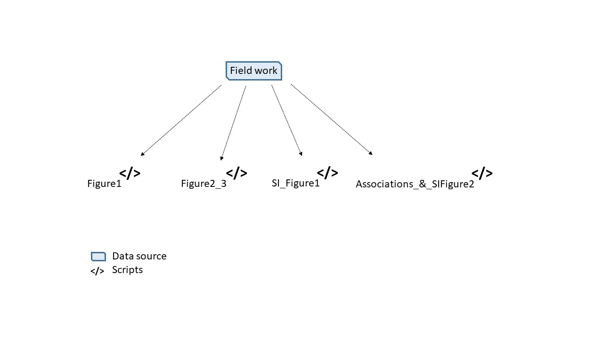

# tropituna_skipper_adapt_transform

## Description

This repository allows to replicate results from the article *Adaptation and transformation responses to climate change impacts in a large-scale tuna fishery*. The scripts in Figure 1 produce figures from the manuscript.

**Figure 1. Scripts workflow.** Arrows indicate where the necessary data to run scripts come from.
